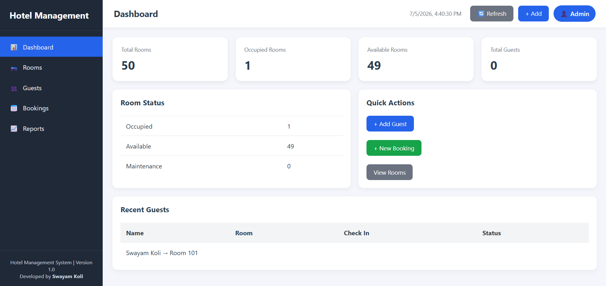
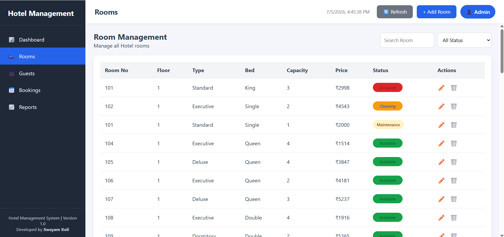
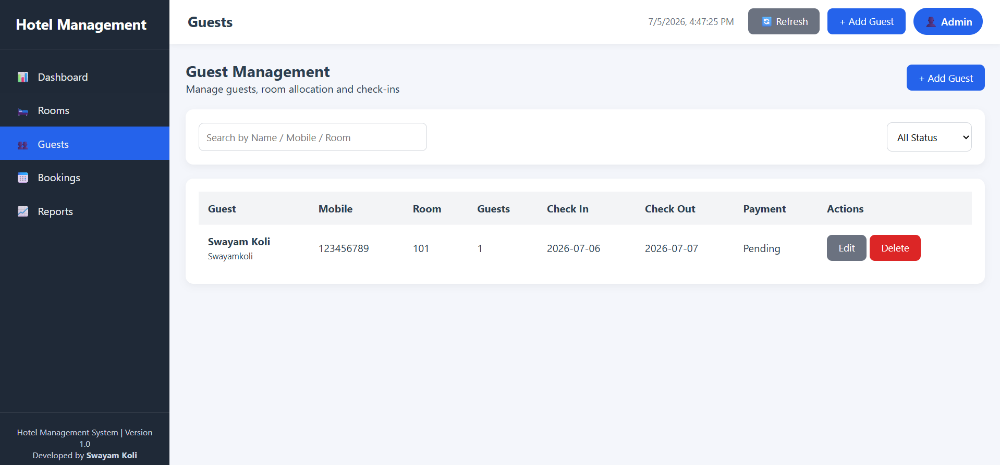
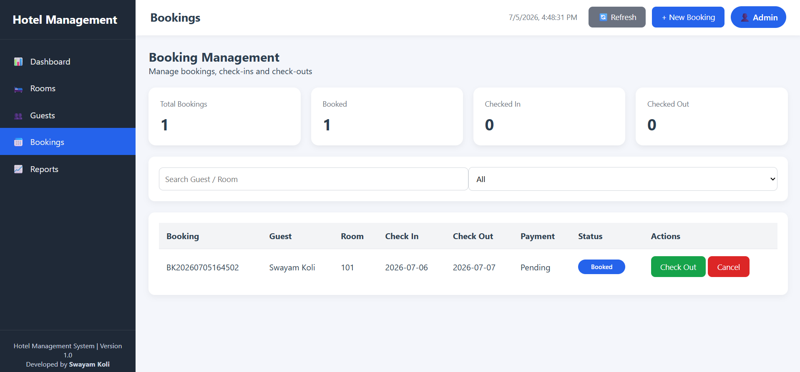
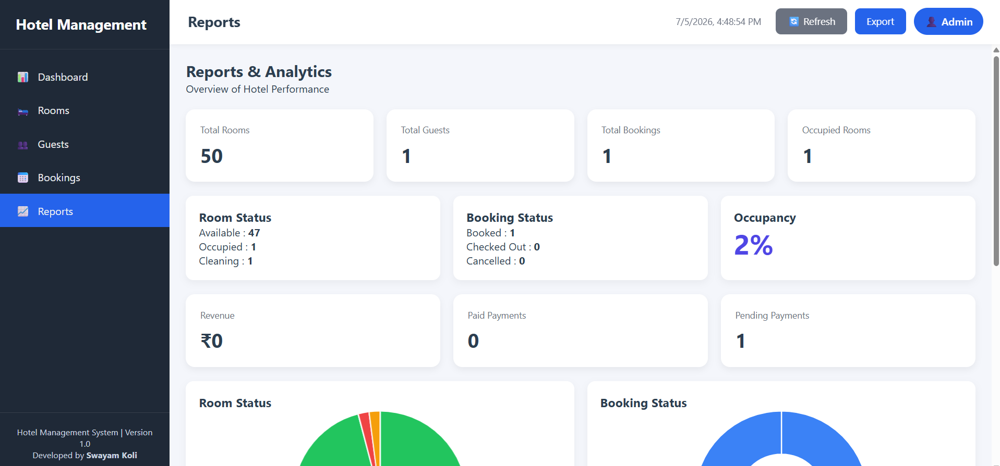
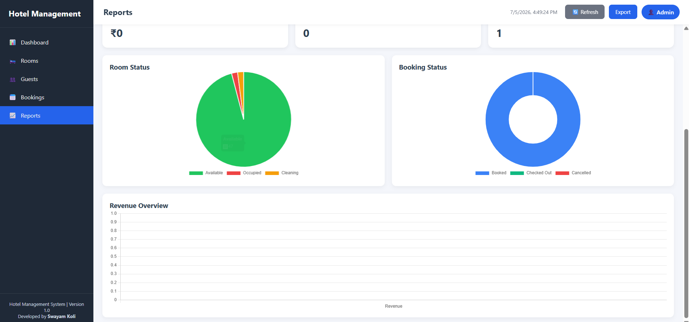

# 🏨 Hotel Management System


A web-based **Hotel Management System** developed using **Google Apps Script, HTML, CSS, JavaScript, Google Sheets, and Chart.js**.

The application streamlines hotel operations by providing an interactive dashboard for managing rooms, guests, bookings, and reports with real-time updates using Google Sheets as the backend database.

---

# 📌 Project Overview

This Hotel Management System is designed to simplify day-to-day hotel operations through an easy-to-use web interface.

The system allows hotel staff to:

- Manage Rooms
- Register Guests
- Create and Manage Bookings
- Track Room Availability
- Generate Reports & Analytics
- Monitor Occupancy Statistics

---

# ✨ Features

## 📊 Dashboard
- Hotel Overview Dashboard
- Room Statistics
- Booking Statistics
- Occupancy Summary
- Interactive Cards

---

## 🛏 Room Management
- Add New Rooms
- Update Room Status
- Delete Rooms
- Track Room Availability
- Cleaning Status Management

---

## 👥 Guest Management
- Guest Registration
- Guest Information Management
- Room Allocation
- Guest Records

---

## 📅 Booking Management
- Create New Bookings
- Check-In
- Check-Out
- Cancel Bookings
- Automatic Room Status Updates

---

## 📈 Reports & Analytics
- Room Occupancy Statistics
- Booking Statistics
- Revenue Overview
- Interactive Charts using Chart.js

---

# 🖼 Application Screenshots

## Dashboard



---

## Add Room


---

## Rooms



---

## Add Guest


---

## Guests



---

## Bookings



---

## Reports

### Overview



### Charts



---

# 🛠 Technology Stack

- Google Apps Script
- Google Sheets
- HTML
- CSS
- JavaScript (ES6)
- Chart.js

---

# 📂 Project Structure

```
Hotel-Management-System
│
├── Images
│   ├── Dashboard.png
│   ├── Add Guest.png
│   ├── Add Rooms.png
│   ├── Guests.png
│   ├── Rooms.png
│   ├── Bookings.png
│   ├── Reports_1.png
│   └── Reports_2.png
│
├── Source-Code
│   ├── BookingsPage
│   ├── Dashboard.gs
│   ├── DashboardPage.gs
│   ├── Guest
│   ├── GuestManager.gs
│   ├── Header
│   ├── JS
│   ├── Main
│   ├── Menu.gs
│   ├── Modals
│   ├── ReportsForm
│   ├── ReportManager.gs
│   ├── ReportsPages
│   ├── RoomManager.gs
│   ├── Rooms
│   ├── RoomsPage
│   ├── RoomService.gs
│   ├── Scripts
│   ├── Sidebar
│   ├── Styles
│   ├── FormStyles
│   ├── CSS
│   ├── Config.gs
│   ├── Database.gs
│   ├── UI.gs
│   ├── Utilities.gs
│   └── Validation.gs
│
└── README.md
```

---

# 🚀 Key Highlights

- Responsive User Interface
- Google Apps Script Backend
- Google Sheets Database
- CRUD Operations
- Interactive Dashboard
- Room Availability Tracking
- Booking Management
- Guest Management
- Reports & Analytics
- Chart.js Visualizations

---

# 🔮 Future Enhancements (Version 2.0)

- Guest Editing
- Room Editing
- Excel Export
- PDF Report Generation
- Billing & Invoice System
- Role-Based Login
- Email Notifications
- Advanced Analytics

---

# 👨‍💻 Developer

### Designed & Developed by

## **Swayam Koli**

---

# 📄 License

This project is created for educational, learning, and portfolio purposes.

---

⭐ If you found this project interesting, consider giving it a **Star**.
